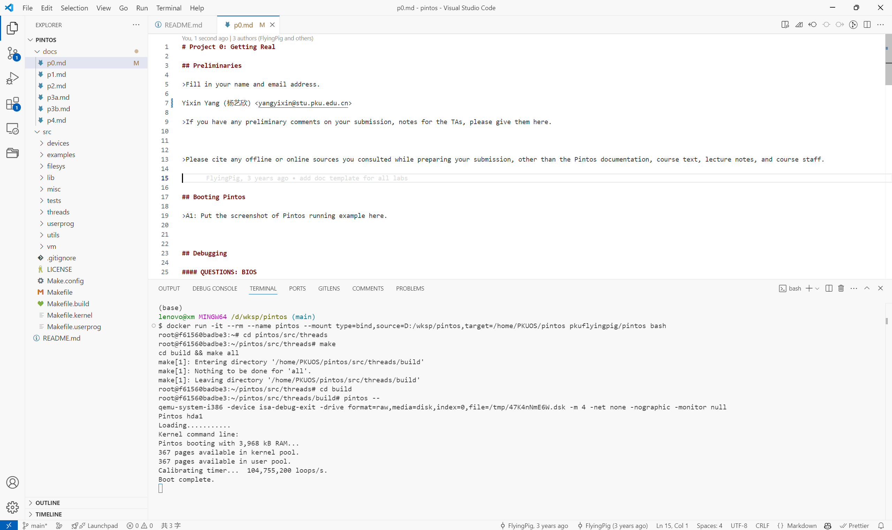
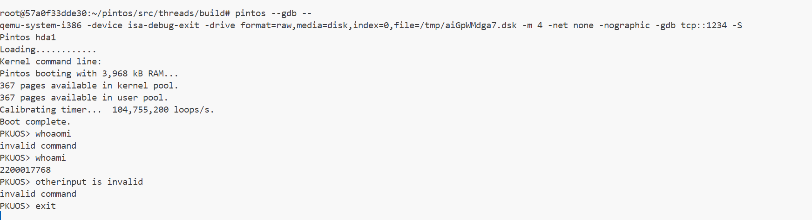

# Project 0: Getting Real

## Preliminaries

>Fill in your name and email address.

Yixin Yang (杨艺欣) <yangyixin@stu.pku.edu.cn>

>If you have any preliminary comments on your submission, notes for the TAs, please give them here.

>Please cite any offline or online sources you consulted while preparing your submission, other than the Pintos documentation, course text, lecture notes, and course staff.

## Booting Pintos

>A1: Put the screenshot of Pintos running example here.

## Debugging

#### QUESTIONS: BIOS 

>B1: What is the first instruction that gets executed?

`ljmp   $0x3630,$0xf000e05b`

>B2: At which physical address is this instruction located?

`0xffff0`

#### QUESTIONS: BOOTLOADER

>B3: How does the bootloader read disk sectors? In particular, what BIOS interrupt is used?

In `read_sector`, the bootloader reads disk sectors by using BIOS interrupt `0x13`. The parameters of the interrupt include LBA sector number, buffer segment and offset, number of sectors to read, and packet size. It also sets `ah` to `0x42` to perform extended read. The return status is stored in CF flag (clear if success). Registers are saved in the beginning and restored in the end of the function.

>B4: How does the bootloader decides whether it successfully finds the Pintos kernel?

For every disk:

- read the first sector of the disk by calling `read_sector`
- if success, check MBR signature (`0xaa55`) at the end of the sector (`%es:510`)
- if success, check partitions for unused bootable Pintos kernel partition
  - check if unused: `cmpl $0, %es:(%si)` where `%si` stores `446`
  - check if a Pintos kernel partition: `cmpb $0x20, %es:4(%si)`
  - check if bootable: `cmpb $0x80, %es:(%si)`
- if success, the Pintos kernel is found

>B5: What happens when the bootloader could not find the Pintos kernel?

The bootloader will check the next partition entry. If all entries are checked and no Pintos kernel is found, it will check the next disk. If still no Pintos kernel is found, it will jump to `no_such_drive` and print `Not found` and notify BIOS that the boot failed using `int $0x18`.

>B6: At what point and how exactly does the bootloader transfer control to the Pintos kernel?

The bootloader loads the Pintos kernel into physical address `0x20000` (segment `0x2000`) by reading up to 1024 sectors (512 KB) by `read_sector`. After loading, it extracts the 32-bit entry point from the ELF header at offset `0x18`, discards the upper 16 bits, and combines the lower 16 bits with `0x2000` to form a real-mode`segment:offset` address stored in `start`. Then it transfers control to the Pintos kernel by `ljmp *start`.

#### QUESTIONS: KERNEL

>B7: At the entry of pintos_init(), what is the value of expression `init_page_dir[pd_no(ptov(0))]` in hexadecimal format?

`0x0`

>B8: When `palloc_get_page()` is called for the first time,

>> B8.1 what does the call stack look like?
>> 
>> Breakpoint 2, palloc_get_page (flags=(PAL_ASSERT | PAL_ZERO)) at ../../threads/palloc.c:113
>> (gdb) bt
>> #0  palloc_get_page (flags=(PAL_ASSERT | PAL_ZERO)) at ../../threads/palloc.c:113
>> #1  0xc00204d7 in paging_init () at ../../threads/init.c:201
>> #2  0xc002031b in pintos_init () at ../../threads/init.c:100
>> #3  0xc002013d in start () at ../../threads/start.S:180

>> B8.2 what is the return value in hexadecimal format?
>>
>> (gdb) finish
>> Run till exit from #0  palloc_get_page (flags=(PAL_ASSERT | PAL_ZERO)) at ../../threads/palloc.c:113
>> => 0xc00204d7 <paging_init+17>: add    \$0x10,%esp
>> 0xc00204d7 in paging_init () at ../../threads/init.c:201
>> Value returned is \$5 = (void *) 0xc0101000
>> 

>> B8.3 what is the value of expression `init_page_dir[pd_no(ptov(0))]` in hexadecimal format?
>>
>> `0x0`

>B9: When palloc_get_page() is called for the third time,

>> B9.1 what does the call stack look like?
>>
>> Breakpoint 2, palloc_get_page (flags=PAL_ZERO) at ../../threads/palloc.c:113
>> (gdb) bt
>> #0  palloc_get_page (flags=PAL_ZERO) at ../../threads/palloc.c:113
>> #1  0xc0020bae in thread_create (name=0xc002e9e5 "idle", priority=0, function=0xc0020fdd <idle>, aux=0xc000efac) at ../../threads/thread.c:178
>> #2  0xc0020aa3 in thread_start () at ../../threads/thread.c:111
>> #3  0xc0020334 in pintos_init () at ../../threads/init.c:119
>> #4  0xc002013d in start () at ../../threads/start.S:180

>> B9.2 what is the return value in hexadecimal format?
>>
>> (gdb) finish
>> Run till exit from #0  palloc_get_page (flags=PAL_ZERO) at ../../threads/palloc.c:113
>> => 0xc0020bae <thread_create+55>:       add    \$0x10,%esp
>> 0xc0020bae in thread_create (name=0xc002e9e5 "idle", priority=0, function=0xc0020fdd <idle>, aux=0xc000efac) at ../../threads/thread.c:178
>> Value returned is \$8 = (void *) 0xc0103000

>> B9.3 what is the value of expression `init_page_dir[pd_no(ptov(0))]` in hexadecimal format?
>>
>> `0x102027`

## Kernel Monitor

>C1: Put the screenshot of your kernel monitor running example here. (It should show how your kernel shell respond to `whoami`, `exit`, and `other input`.)

#### 

>C2: Explain how you read and write to the console for the kernel monitor.

Read: Allocate a buffer of 512 bytes and read from the console using `input_getc` until `'\n'` or `'\r'` is encountered or the buffer is full (It will truncate input to 512 bytes. This is to prevent buffer overflow).  

Write: Use `printf`